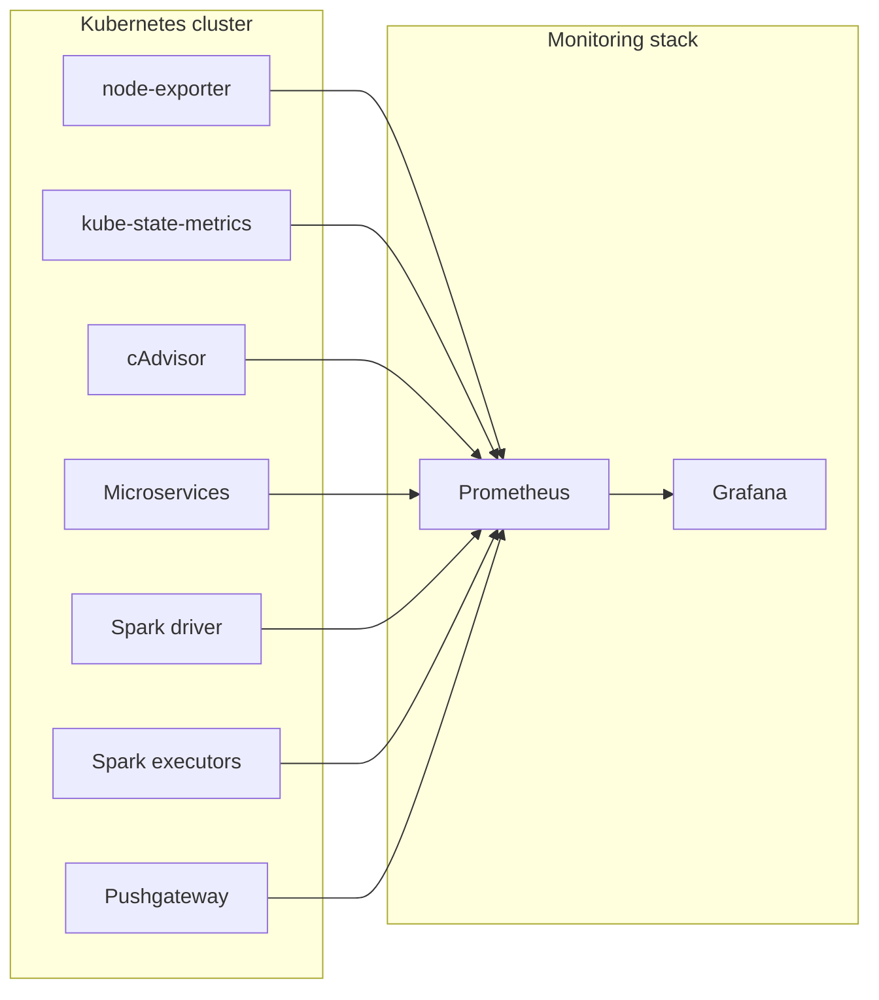

# Архитектурная документация: мониторинг Kubernetes + Spark (Prometheus + Grafana)

Цель:
- Спроектировать гибкую систему мониторинга для кластера Kubernetes с долгоживущими микросервисами и пакетными (batch) Spark-джобами.
- Обеспечить сбор метрик инфраструктуры, приложений и Spark (driver/executor), визуализацию в Grafana, правила алертинга и подход к сбору метрик короткоживущих джоб.

Область покрытия:
- Kubernetes (pods, nodes, kube-system)
- Долгоживущие микросервисы (контейнеры)
- Spark: драйверы и исполнители (executors), batch и streaming
- Инфраструктурные экспортеры и вспомогательные компоненты (node-exporter, kube-state-metrics, cAdvisor, Pushgateway)

Высокоуровневая архитектура
- Prometheus (или Prometheus Operator) собирает метрики от:
	- `node-exporter` (метрики ноды)
	- `kube-state-metrics` (K8s-объекты)
	- `cAdvisor` (контейнеры)
	- JMX/Prometheus exporter для Spark (driver/executor)
	- application-specific exporters / custom metrics (HTTP)
- Grafana подключена к Prometheus и содержит набор дашбордов

Компоненты и способы интеграции
- Prometheus (scrape + service discovery через k8s)
- Prometheus Operator / kube-prometheus-stack (helm чарт)
- node-exporter (textfile collector - опция для node-local метрик)
- kube-state-metrics
- JMX exporter для Spark метрик
- Объект хранения/логи (S3/MinIO / Spark event logs) для анализа

1. Ключевые метрики и рекомендуемые лейблы
Каждая метрика должна содержать набор лейблов для корреляции: `namespace`, `pod`, `container`, `app`, `job`, `spark_role` (driver|executor), `application_id`, `spark_job`, `stage`, `task`.

- Spark: `spark_executor_active_tasks_total{application_id,spark_role,executor_id,namespace,pod}` - количество активных задач на executor.
	- Значение: целое число.
- Spark: `spark_executor_completed_tasks_total{application_id,stage,executor_id}` - всего завершенных задач.

- Spark: `spark_task_duration_seconds_bucket{application_id,stage,le}` и `spark_task_duration_seconds_sum/count` - гистограмма длительностей задач (percentiles через PromQL).

- Spark: `spark_shuffle_read_bytes_total{application_id,executor_id,namespace}` и `spark_shuffle_write_bytes_total{...}` - объемы shuffle I/O.

- Spark: `spark_executor_memory_used_bytes{application_id,executor_id}` - память, используемая executor-ом (heap+offheap если доступно).

- JVM/process: `process_cpu_seconds_total{pod,container,namespace,app}`, `process_resident_memory_bytes{...}`, `jvm_gc_pause_seconds_sum/count`.
	- Полезно для диагностики GC и поведения JVM, даже при наличии контейнерных метрик.

- Kubernetes infra: `kube_pod_container_status_restarts_total{pod,namespace,container}`, `container_memory_usage_bytes{pod,namespace,container}`, `container_cpu_usage_seconds_total{pod,namespace,container}`.

- Business/custom: `app_records_processed_total{job,application_id,namespace}`, `app_records_failed_total{job, application_id, namespace, executor_id}`, `app_output_bytes_total{executor_id, application_id, namespace, pod}`.
	- Источник: инструментирование приложения или итоговый push в Pushgateway после завершения джобы.

2. Предлагаемые дашборды и примеры PromQL

2.1. Dashboard: Cluster / System Health
- Цель: мониторинг нагрузки нод и контейнеров, доступности сервисов.
- Важные панели и PromQL:
	- CPU usage (по namespace):
		- `sum(rate(container_cpu_usage_seconds_total{namespace!="kube-system"}[5m])) by (namespace)`
	- Memory usage (по pod):
		- `sum(container_memory_usage_bytes{namespace=~"myapp|spark"}) by (pod)`
	- Pod restarts (анализ стабильности):
		- `increase(kube_pod_container_status_restarts_total[1h])`
	- Node filesystem pressure (если node-exporter экспортит):
		- `node_filesystem_avail_bytes / node_filesystem_size_bytes` (в процентах)

2.2. Dashboard: Spark Performance (driver / executor)
- Цель: быстро понять состояние выполнения Spark-джобов и узкие места.
- Панели и PromQL:
	- Active tasks per executor:
		- `sum(spark_executor_active_tasks_total{application_id=~"$app"}) by (executor_id)`
	- Task duration P95/P99:
		- `histogram_quantile(0.95, sum(rate(spark_task_duration_seconds_bucket{application_id=~"$app"}[5m])) by (le))`
	- Shuffle I/O throughput:
		- `sum(rate(spark_shuffle_read_bytes_total{application_id=~"$app"}[1m])) by (executor_id)`
	- Executors alive / removed:
		- `count(spark_executor_memory_used_bytes{application_id=~"$app"}) by (executor_id)`
	- Driver JVM GC pause (спайки влияющие на задержки):
		- `rate(jvm_gc_pause_seconds_sum{application_id=~"$app"}[5m])`

2.3. Dashboard: Business Metrics
- Цель: наблюдать метрики уровня бизнеса (records processed, throughput, error counts).
- Примеры:
	- Throughput (records/s):
		- `sum(rate(spark_executor_completed_tasks_total[1m])) by (job)`
	- Error rate:
		- `sum(rate(app_records_failed_total{job=~"$job"}[5m])) by (job) / sum(rate(app_records_processed_total{job=~"$job"}[5m])) by (job)`
	- Data volume processed:
		- `increase(app_output_bytes_total{job=~"$job"}[1h])`

3. Правила алертинга, уровень серьёзности и возможные ложные срабатывания

- Alert: Spark executor high CPU
	- Expr: `avg by (executor_id)(rate(process_cpu_seconds_total{job="spark-executor"}[2m])) > 0.8`
	- For: 2m
	- Severity: medium
	- Причина: executor сильно нагружен, возможно падение производительности.
	- Ложные срабатывания: краткие пиковые нагрузки, бурстовые этапы (например shuffle).

- Alert: Excessive failed tasks
	- Expr: `rate(spark_task_failed_total{application_id=~".+"}[5m]) > 0.1` (больше 10 процентов фейлов)
	- For: 5m
	- Severity: high
	- Причина: много фейлов задач, возможны баги в коде или проблемы с ресурсами.
	- Ложные срабатывания: при стартах и перезапусках приложений, временные сетевые проблемы.
	- Градации: аналогичный алерт для > 1 процента с severity info, > 3 процента severity low.

- Alert: Long GC pause on driver
	- Expr: `increase(jvm_gc_pause_seconds_sum{spark_role="driver"}[10m]) > 60` (суммарно больше минуты за 10 минут, около 10 процентов времени)
	- For: 5m
	- Severity: medium
	- Что значит: driver подвисает, джобы могут тормозить.
	- Ложные срабатывания: краткосрочные паузы, которые не влияют на обработку.

- Alert: Processing throughput drop 
	- Expr: `sum(rate(app_records_processed_total[5m])) by (job) < scalar(0.5 * avg_over_time(sum(rate(app_records_processed_total[1m])) by (job)[1h:1m]))`
	- For: 10m
	- Severity: warning/critical
	- Что значит: резкое падение throughput относительно предыдущего часового baseline.
	- Ложные срабатывания: плановая остановка, deployment.

4. Сбор метрик с короткоживущих Spark-джоб (проблема и решения)

Проблема:
- Batch Spark-джобы часто живут секунды-минуты; если метрики публикуются через обычный HTTP-exporter и Prometheus scrapes по расписанию, scrape может не успеть - метрики теряются.

Рассмотренные подходы и рекомендации:

1) Pushgateway
	- Паттерн: в конце выполнения джоба job пушит итоговые метрики (processed_rows, errors, duration) в Pushgateway с метками `application_id`, `job_id`, `status`.
	- Prometheus периодически скрейпит Pushgateway; Grafana использует эти метрики для отчетов.
	- Плюсы: простота, надёжность для финальных метрик.
	- Минусы: Pushgateway не предназначен для лёгкой временной метрики, надо аккуратно управлять life-cycle (удаление старых метрик).

2) Sidecar exporter / In-pod HTTP endpoint
	- Паттерн: вместе с джобом запускается короткоживущий sidecar, который отдает метрики до тех пор, пока pod жив. Если Prometheus успеет - скрейпит напрямую.
	- Плюсы: гибкость, можно отдавать rich-metrics; минусы: повышенная сложность, требует синхронизации.

4) Spark event logs + post-processing
	- Spark может писать event logs (History Server). Отдельный ETL/processor конвертирует логи в метрики и пушит их в Prometheus (через Pushgateway / custom exporter).

5. Примерная схема архитектуры

