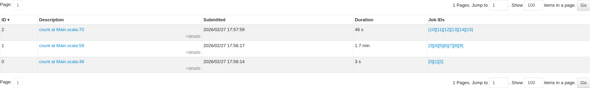
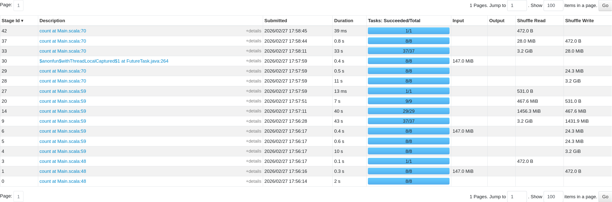

## Пример
В данном примере у нас есть события, почтовые индексы и пользователи. Пусть это будут некоторые покупки.

Основными проблемами являются следующие вещи: пристуствует небольшой range postal_codes, Также пристуствует довольно заметный skew (~ 70% user_id в events равны 1)

Всего есть 3 джобы. Первой будем считать за baseline:
2 join, groupBy и аггрегации по сумме amount и количеству postal_code.

Первой оптимизацией является broadcast



Можно заметить, как shuffle write уменьшился с 1.5Gb до 23 Mb в основном stage.

Также стоит отметить, что это заметно только потому, что postal_codes > 10Mb, что является порогом, и при  меньших значениях автоматически происходит broadcast.

За вторую оптимизацию возьмём KryoSerializer:
`.config("spark.serializer", "org.apache.spark.serializer.KryoSerializer")`

К сожалению он никак не влияет на текущий пример, т.к. данные довольно примитивны (числа и строки).

Рассмотрим теперь оптимизацию с помощью salting.
У нас есть сильный skew по users_id в events датафрейме. Можно применять salting только в тех случаях, когда используется несколько executer'ов. К сожалению я не могу показать это на своей машине, т.к. пока не до конца разобрался с нормальной установкой spark на своей машине. Но данный метод должен уменьшить время выполнения из-за того, что при группировке по user_id без salting'а около 70% всех значений из датафрейма events попадает на 1 executor, что создаёт перевес по количеству обрабатываемых данных. При применении salt мы получим примерно равномерное распределение этих 70% значений на NUM_SALTS партиций, которые уже смогут обрабатываться несколькими executor'ами параллельно.

В данном случае salting выглядил бы примерно вот так:
```scala
val numSalts = 20 
val saltedEvents = events
  .withColumn("salt", (rand() * numSalts).cast("int"))

val saltedUsers = users
  .withColumn("salt", explode(array((0 until numSalts).map(lit): _*)) )

val saltedJoin = saltedEvents
  .join(saltedUsers, Seq("user_id", "salt"))
  .join(postals, "postal_id")

val partialAgg = saltedJoin
  .groupBy("user_id", "salt")
  .agg( sum("amount").alias("partial_amount"),
    count("postal_code").alias("partial_count")
  )

val finalAgg = partialAgg
  .groupBy("user_id")
  .agg( sum("partial_amount").alias("total_amount"),
    sum("partial_count").alias("same_postal_code") 
  )
finalAgg.count()
```