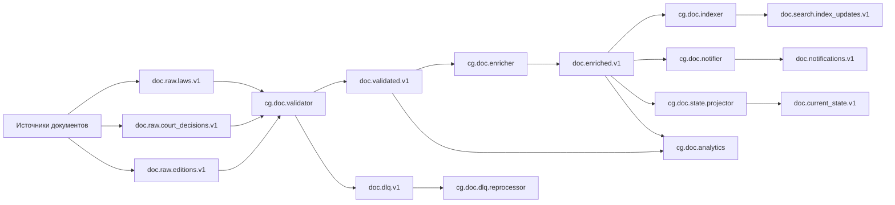

# ДЗ 7

## 1. Архитектура топиков

### 1.1 Потоки и топики

1. `doc.raw.laws.v1`
- Назначение: сырые события по законам из внешних источников
- Ключ: `doc_id`
- Партиции: 16

2. `doc.raw.court_decisions.v1`
- Назначение: сырые события по судебным решениям
- Ключ: `doc_id`
- Партиции: 16

3. `doc.raw.editions.v1`
- Назначение: поступающие редакции/изменения документа.
- Ключ: `doc_id`
- Партиции: 32
- Обоснование: редакции обычно более частые, закладываем больший параллелизм.

4. `doc.validated.v1`
- Назначение: нормализованные и провалидированные события после проверки схемы/качества
- Ключ: `doc_id`
- Партиции: 32

5. `doc.enriched.v1`
- Назначение: события после некой обработки (классификация документов, добавление к ним метаданных)
- Ключ: `doc_id`
- Партиции: 32

6. `doc.search.index_updates.v1`
- Назначение: изменения для поискового индекса
- Ключ: `doc_id`
- Партиции: 16
- Обоснование: индексирующий сервис обычно тяжелее CPU, но поток ниже, чем у внутренних топиков

7. `doc.notifications.v1`
- Назначение: бизнес-события для уведомлений (новая редакция, важные изменения и т.д.)
- Ключ: `subscriber_id`
- Партиции: 8

8. `doc.current_state.v1`
- Назначение: хранение текущей версии документа после обработки
- Ключ: `doc_id`
- Партиции: 16 ()

9. `doc.dlq.v1`
- Назначение: ошибки обработки и невалидные сообщения
- Ключ: `source_topic + partition + offset`
- Партиции: 4
- Отдельный поток для ретраев и ручного разбора

### 1.2 Почему ключ `doc_id`
- Гарантирует порядок событий одного документа внутри партиции.
- Упрощает идемпотентную обработку и построение актуального состояния.
- Предсказуемо масштабируется: увеличение числа документов равномерно загружает партиции.

---

## 2. Политики хранения (retention / cleanup)

1. Для `doc.raw.*`:
- `cleanup.policy=delete`
- `retention=` 7 дней
- `retention.bytes` ограничить на уровне кластера/топика по емкости.
-  Cырые события нужны ограниченное время для переигрывания инжеста.

2. Для `doc.validated.v1`, `doc.enriched.v1`:
- `cleanup.policy=delete`
- `retention=`30 дней
- Чуть большее время хранения для возможности корректировок

3. Для `doc.current_state.v1` (состояние актуальной версии документа):
- `cleanup.policy=compact`
- ключ `doc_id`
- Нет смысла хранить несколько последних значений на 1 ключ

4. Для `doc.dlq.v1`:
- `cleanup.policy=delete`
- `retention=` 90 дней
- Нужно хранить продолжительное время для возможности нахождения багов обработки/нормализации

---

## 3. Гарантии доставки и надежность

### 3.1 Продюсеры
- `enable.idempotence=true`
- `acks=all`
- `retries` большой

Это дает надежную запись и защиту от дублей при ретраях.

### 3.2 Брокеры / топики
- `replication.factor=3`
- `min.insync.replicas=2`
- корректные `unclean.leader.election.enable=false`

Это снижает риск потери данных при отказах узлов.

### 3.3 Потребители
- Ручной commit offset после успешной обработки.
- Для побочных эффектов (БД/индекс) использовать идемпотентный upsert по `doc_id` и `event_id`.
- При ошибках: retry-topic (по необходимости) и затем DLQ.

Итоговая модель: как минимум один раз (at-least-once) + идемпотентная обработка на выходе.

### 3.4 Транзакции
Для критичных связок read-process-write (например, validated -> enriched) можно включать Kafka transactions, чтобы получить exactly-once между Kafka-топиками.

---

## 4. Группы потребителей

1. `cg.doc.validator`
- Читает: `doc.raw.*`
- Пишет: `doc.validated.v1` и/или `doc.dlq.v1`

2. `cg.doc.enricher`
- Читает: `doc.validated.v1`
- Пишет: `doc.enriched.v1`

3. `cg.doc.indexer`
- Читает: `doc.enriched.v1`
- Пишет: `doc.search.index_updates.v1` или обновляет внешний индекс

4. `cg.doc.notifier`
- Читает: `doc.enriched.v1`
- Пишет: `doc.notifications.v1`

5. `cg.doc.analytics`
- Читает: `doc.validated.v1`, `doc.enriched.v1`
- Используется для BI/ML/отчетности

6. `cg.doc.dlq.reprocessor`
- Читает: `doc.dlq.v1`
- Выполняет переобработку или маршрутизацию в ручной разбор

7. `cg.doc.state.projector`
- Читает: `doc.enriched.v1`
- Пишет: `doc.current_state.v1`
- Поддерживает «последнее состояние документа» в compact-топике

---

## 5. Схема пайплайна

